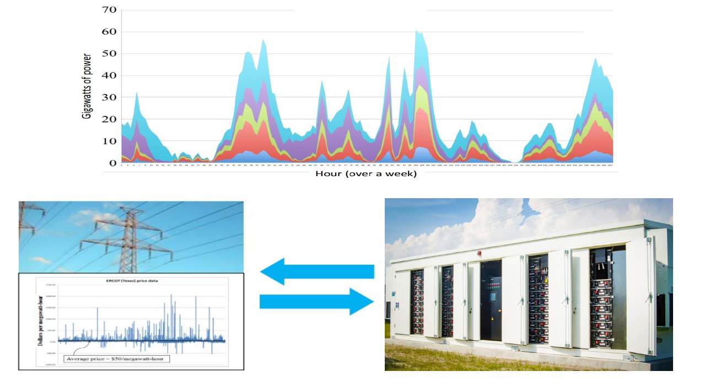
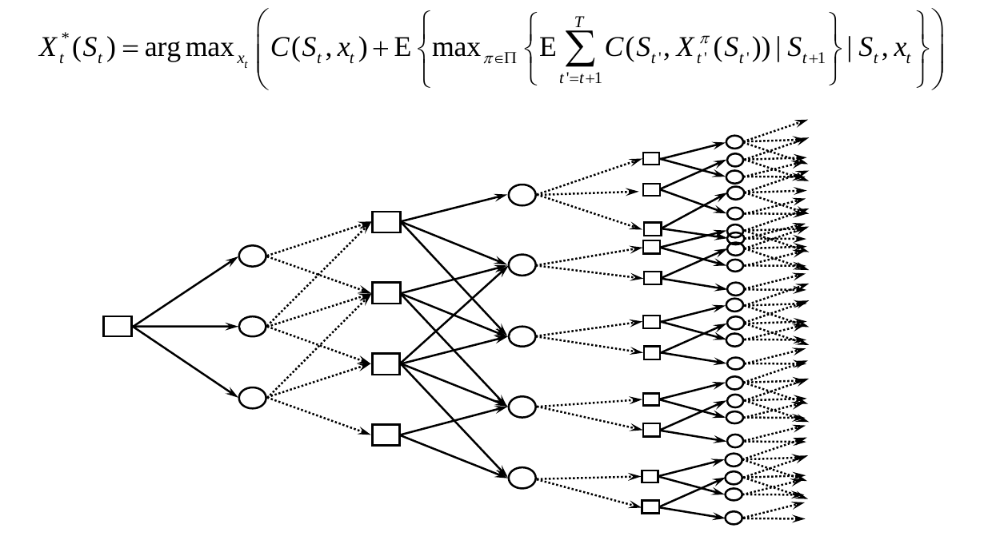
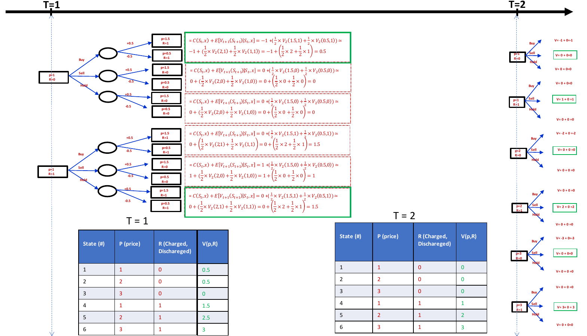
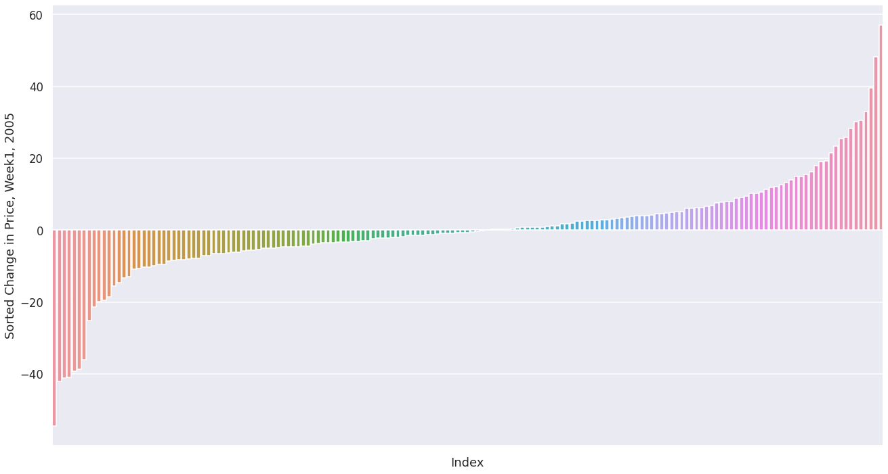

```{r setup, include=FALSE}
knitr::opts_chunk$set(echo = FALSE)
```

# Introduction

- The coastal region of Europe has seen a growing interest in wind energy. A challenge with wind energy sources is handling the variability. 
- A simple solution to handle this variability is to sell any electricity from a renewable source into the grid and use the tremendous power of the grid to handle this variability. 
- However, there has been considerable interest in using storage (particularly battery storage) to handle variability in renewable energies. The battery storage provides flexibility to the energy provider. 


## Objectives

1. Illustrate and introduce the workflow for solving sequential Decision problems
2. Present Value Function Approximation (VFA) based on the Bellman optimality equation as a policy for decision in hand.

```{r standard-plot1, out.width='80%', fig.align='center', fig.cap='The Electricity Storage Decision Schematics'}

```

# Methods

`Lookahead Policy` is optimal:

```{r standard-plot12, out.width='80%', fig.align='center', fig.cap='Lookahead Policy as Decision Tree', fig.height=5, fig.width=8}

```

# Results

**Visual Illustration of Concept:**

- Battery could be fully charged Or Discharged, R t = [1,0]
- The Electricity Price could have three possible scenario, p=[1,2,3]
- The Electricity price could decrease or increase with ,∆p = [−0.5,0.5] each with
 chance.
- The number of time steps is 3, T = [0,1,2]

```{r standard-plot133, out.width='100%', fig.align='center', fig.cap='Lookahead Policy Computation, Small Example', fig.height=14, fig.width=10}

```

### Two data sets, price on Week 1 2005 as train, price on Week 1 2006 to test:
 
```{r plot-hist-test, out.width='100%', fig.align='center', fig.cap='Electricity price at same week, two years', fig.height=8, fig.width=10, fig.retina=2, message=FALSE}
library(tidyverse)
data <- read.csv("../hist_prce.csv")
data$Time <- seq(1,168)

data_rename <- data %>% rename("Price Week 1, 2006"="hist_noise",
                        "Price Week 1, 2005"="hist")

data_rename_2 <- data_rename %>% pivot_longer(-Time,)

ggplot(data_rename_2, aes(Time, value, color=name)) +
  geom_line() +
  ggtitle("Plot of spot electricty price, 2005,2006 ") +
  xlab("Hours in week") + 
  ylab("Price, USD/MWH")

```
 
### Distribution of Hourly Price Change in Training data:
 
- The change in price is needed to model uncertainty in price.

```{r plot-change, out.width='100%', fig.align='center', fig.cap='Sort of change in hourly price', fig.height=8, fig.width=10, fig.retina=2, message=FALSE}


```
### How stored electricity is traded (sell and buy to grid).
 
 - At each time step, the decision is made with taking into account all the `Future` decisions:
 
```{r fin-plot, out.width='100%', fig.align='center', fig.cap='Buying and Selling Time of Battery and, Electricty Price in lower', fig.height=8, fig.width=10, fig.retina=2, message=FALSE}
data_storage <- read.csv("storage_level_f.csv")
data_price <- read.csv("hist_price_f.csv")

data_price$storage <- data_storage$Battery_Storage_.Level
data_price$Time <- seq(1,168)
data_price_rename <- data_price %>% rename("Battery Storage Level"="storage", "Real Hourly Spot Price"="hist_noise") %>% 
  select(-hist)

data_price_rename2 <- data_price_rename %>% pivot_longer(-Time,)

ggplot(data_price_rename2, aes(Time, value)) +
  geom_line() +
  facet_grid(name ~ ., scales = "free_y")

```
 
 - The final contribution (profit) with 1 MWh, is `516.3` USD per week.
 
<!-- **Norway Electricity data:**~ -->

```{r standard-plot134, out.width='100%', fig.align='center', fig.cap='The Electricty Storage Decsion Schematics', fig.height=8, fig.width=10, message=FALSE, include=FALSE}
library(tidyverse)
library(lubridate)
library(patchwork)

elsport_2019 <- read.csv2("elspot-prices_2019_hourly_nok.csv", skip = 2, sep = ",")

elsport_2019_bergen <- elsport_2019 %>% select(c("X","Hours","Bergen")) %>% 
  rename("price"="Bergen") %>% 
  mutate(day_date = dmy(X)) %>%
  mutate(week=lubridate::week(day_date)) %>% 
  select(-c("X"))


elsport_2020 <- read.csv2("elspot-prices_2020_hourly_nok.csv", skip = 2, sep = ",")

elsport_2020_bergen <- elsport_2020 %>% select(c("X","Hours","Bergen")) %>% 
  rename("price"="Bergen") %>% 
  mutate(day_date =  lubridate::dmy(X)) %>% 
  select(-c("X"))


elsport_2020_bergen_1week_feb <- elsport_2020_bergen %>% 
  filter(day_date>"2020-08-30" & day_date<"2020-09-29") %>%     
  mutate(Hours = seq(1,696)) %>% 
  mutate(weeks = rep(seq(1,)))

elsport_2019_bergen_1week_feb <- elsport_2019_bergen %>% 
  filter(day_date>"2019-08-30" & day_date<"2019-09-29") %>%         
  mutate(Hours = seq(1,696))


p1 <- ggplot(elsport_2019_bergen_1week_feb,aes(Hours,price)) +
  geom_line() + 
  ggtitle("Plot of spot electricty price, 2019 ") +
  xlab("Hours in month") + 
  ylab("Price, NOK/MWH  ")
  

p2 <- ggplot(elsport_2020_bergen_1week_feb,aes(Hours,price)) +
  geom_line() +
  ggtitle("Plot of spot electricty price, 2020 ") +
  xlab("Hours in month") + 
  ylab("Price, NOK/MWH  ")

p1 + p2
```

<!-- # Next Steps -->

<!-- - In this work, we discretized the state and decision space in a manner that the MDP problem can be solved in a computationally tractable way.  -->

<!-- - Future work will apply the workflow to the high dimensional state-decision space in a computationally efficient way. -->

# Conclusion

- We show that policy trained using Lookahead policy on historical price data consistently generated profit revenue for decision-maker.
- The next step is to apply workflow for more difficult, stochastic spot electricity prices.